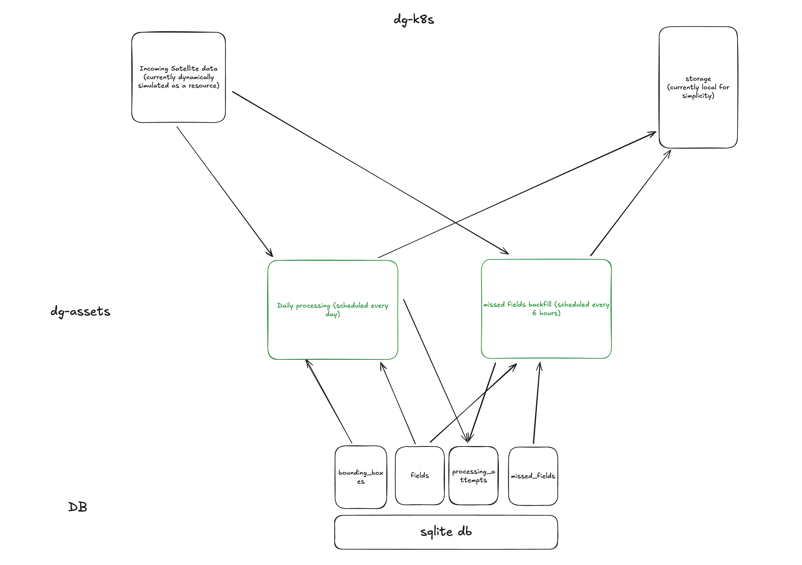

# Dagster Kubernetes Pipeline Project
A simple example of data pipeline built using Dagster on Kubernetes, designed for processing satellite data for daily scheduled tasks with measures taken for late arrival data.  
The project is using simulated data and processes. 



## 💾 Database Structure

The project uses SQLite (development) with the following table structure:

### Bounding Boxes
```sql
CREATE TABLE bounding_boxes (
    bbox_id INTEGER PRIMARY KEY AUTOINCREMENT,
    name TEXT NOT NULL,
    geometry TEXT NOT NULL,
    created_at TEXT DEFAULT CURRENT_TIMESTAMP,
    active INTEGER DEFAULT 1
)
```
Stores geographical regions for processing. Each box represents an area where satellite data is collected.

### Fields
```sql
CREATE TABLE fields (
    field_id INTEGER PRIMARY KEY AUTOINCREMENT,
    name TEXT NOT NULL,
    geometry TEXT NOT NULL,
    created_at TEXT DEFAULT CURRENT_TIMESTAMP,
    planting_date TEXT NOT NULL,
    active INTEGER DEFAULT 1
)
```
Contains agricultural fields that need monitoring. Each field has a geometry and planting date for crop tracking.

### Missed Fields
```sql
CREATE TABLE missed_fields (
    id INTEGER PRIMARY KEY AUTOINCREMENT,
    field_id INTEGER NOT NULL,
    bbox_id INTEGER NOT NULL,
    processing_time TEXT NOT NULL,
    date_missed TEXT NOT NULL,
    processed INTEGER DEFAULT 0,
    resolved_time TEXT DEFAULT NULL,
    FOREIGN KEY (field_id) REFERENCES fields (field_id),
    FOREIGN KEY (bbox_id) REFERENCES bounding_boxes (bbox_id)
)
```
Tracks fields that couldn't be processed in real-time. Used for backfilling and data recovery.

### Processing Attempts
```sql
CREATE TABLE processing_attempts (
    attempt_id INTEGER PRIMARY KEY AUTOINCREMENT,
    field_id INTEGER,
    bbox_id INTEGER,
    processing_time REAL DEFAULT CURRENT_TIMESTAMP,
    processing_type TEXT NOT NULL CHECK(processing_type IN ('realtime', 'reprocessing')),
    error_code TEXT,
    created_at TEXT DEFAULT CURRENT_TIMESTAMP,
    FOREIGN KEY (field_id) REFERENCES fields (field_id),
    FOREIGN KEY (bbox_id) REFERENCES bounding_boxes (bbox_id)
)
```
Records all processing attempts, successful or failed, for audit and monitoring purposes.

### Key Relationships
- Fields and bounding boxes have a many-to-many relationship
- Missed fields track which fields failed processing in which bounding box
- Processing attempts maintain a complete history of all data processing operations

### Sample Data
The database comes pre-populated with:
- 2 bounding box regions (Region A, Region B)
- 3 sample farms with different planting dates
- Geometries stored as GeoJSON Polygons


## Quick Start

### Prerequisites

- Docker Desktop
- Minikube v1.32+
- kubectl v1.28+
- Python 3.11+
- Make

### Setup

1. **Start Minikube**
```bash
minikube start
```

2. **Install Dependencies**
```bash
make install
```

3. **Build & Deploy**
```bash
make build_docker
make deploy
```

4. **Access Dagster UI**
```bash
make forward_k8s
```

Then visit: http://localhost:3002

## 🛠 Development Commands

| Command | Description |
|---------|-------------|
| `make format` | format and fix your python code using ruff |
| `make build_docker` | Build and load image to Minikube |
| `make deploy` | Deploy to Kubernetes |
| `make clean_k8s` | Clean up K8s resources |
| `make check_pod_status` | View pod status |
| `make check_deamon_logs` | View daemon logs |

## Current Features

- **Data Processing**
  - Daily satellite data pipeline
  - Late data backfilling
  - SQLite database storage

- **Infrastructure**
  - Kubernetes deployment
  - Dagster webserver & daemon
  - Persistent storage


## Next Steps

### Phase 1: Infrastructure Enhancement
- [ ] Migrate to PostgreSQL
- [ ] Implement Helm charts
- [ ] Add resource limits & autoscaling
- [ ] Configure health checks
- [ ] Use S3 storage

### Phase 2: Monitoring
- [ ] Add Prometheus metrics
- [ ] Set up structured logging
- [ ] Configure alerts

### Phase 3: Testing & CI/CD
- [ ] Unit tests
- [ ] Integration tests
- [ ] GitHub Actions pipeline


## 📝 License
Nothing here is under any license, feel free to use the code in whatever you wanna do, especially if you can make it better


## Production Notes

This is currently a development setup. For production:
- Implement security best practices
- Configure proper resource limits
- Set up monitoring and alerting
- Use a production-grade database
- Configure backups and disaster recovery

## Support

For issues and feature requests, please [create an issue](https://github.com/yourusername/dg-k8s/issues).

